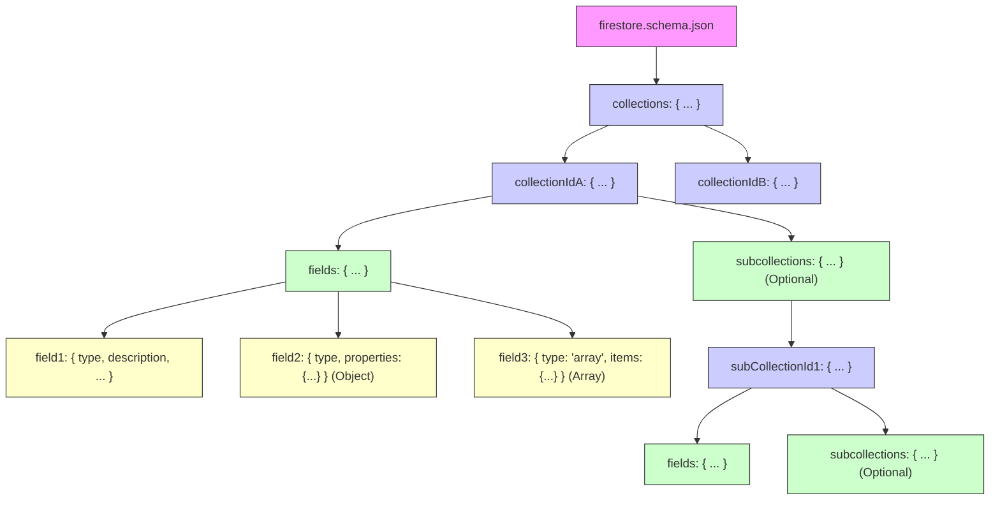

# Schema Definition (`firestore.schema.json`)

FireSchema uses **JSON Schema** (specifically Draft 7 features) as the
foundation for defining your Firestore collections, fields, and subcollections.
This provides a structured, standard, and verifiable way to describe your
database structure.

## Basic Structure

Your schema file (typically named `firestore.schema.json`) should have the
following root structure:

```json
{
  "$schema": "http://json-schema.org/draft-07/schema#", // Optional, but recommended for IDE validation
  "schemaVersion": "1.0", // Or your desired version
  "collections": {
    "users": {
      // Collection definition for 'users'
    },
    "products": {
      // Collection definition for 'products'
    }
    // ... other top-level collections
  }
}
```

- **`$schema`** (Optional): Specifies the JSON Schema dialect. Including this
  helps IDEs provide validation and autocompletion.
- **`schemaVersion`**: Indicates the version of _your_ schema definition (useful
  for tracking changes).
- **`collections`**: An object where each key represents the ID of a top-level
  collection in your Firestore database.


### Schema Structure Visualization



## Collection Definition

Each object within the root `collections` object defines the structure of
documents within that collection:

```json
{
  // ... inside "collections" object ...
  "users": {
    "description": "Stores user profile information.", // Optional
    "fields": {
      // Field definitions for documents in the 'users' collection
    },
    "subcollections": {
      // Optional: Definitions for subcollections under 'users' documents
    }
  }
  // ...
}
```

- **`description`** (Optional): A brief description of the collection's purpose.
  Included as documentation (TSDoc/DartDoc) in generated code.
- **`fields`** (Required): An object defining the fields present in documents
  within this collection. Each key is the field name.
- **`subcollections`** (Optional): An object defining subcollections nested
  under documents in this collection. The structure mirrors the root
  `collections` object, allowing for arbitrary nesting.

## Field Definition

Each object within a `fields` object describes a specific field's type and
properties using standard JSON Schema keywords, plus some FireSchema-specific
extensions.

```json
{
  // ... inside "fields" object ...
  "email": {
    "type": "string", // Required: JSON Schema data type
    "description": "User's primary email address.", // Optional
    "required": true, // Optional: FireSchema uses this for non-nullability (default: false)
    "format": "email" // Optional: Standard JSON Schema format validation
  },
  "age": {
    "type": "integer", // Use "integer" or "number"
    "minimum": 0 // Optional: JSON Schema validation keyword
  },
  "lastLogin": {
    "type": "timestamp", // FireSchema custom type
    "description": "Timestamp of the last user login.",
    "defaultValue": "serverTimestamp" // Optional: FireSchema special default value
  },
  "roles": {
    "type": "array",
    "description": "User roles.",
    "items": { // Required for array type
      "type": "string",
      "enum": ["admin", "editor", "viewer"] // Optional: JSON Schema validation
    },
    "defaultValue": ["viewer"] // Optional: Default array value
  },
  "address": {
    "type": "object", // Use "object" for structured maps
    "description": "Primary address.",
    "properties": { // Standard JSON Schema keyword for object properties
      "street": { "type": "string", "required": true },
      "city": { "type": "string", "required": true },
      "zip": { "type": "string" }
    },
    "required": ["street", "city"] // Optional: Specify required properties of the object
  },
  "primaryOrderRef": {
    "type": "reference", // FireSchema custom type
    "description": "Reference to the user's primary order.",
    "referenceTo": "orders" // Required for reference type: Path to the referenced collection
  },
  "metadata": {
    "type": "object", // A free-form map (no 'properties' defined)
    "description": "Arbitrary key-value metadata."
  },
  "readOnlyField": {
    "type": "string",
    "x-read-only": true // FireSchema custom property
  }
  // ... other fields
}
```

### Supported Field Properties & Types

FireSchema utilizes standard JSON Schema keywords and introduces custom ones
(`timestamp`, `geopoint`, `reference`, `defaultValue`, `referenceTo`,
`x-read-only`).

- **`type`** (Required): Defines the data type.
  - **Standard JSON Schema Types:**
    - `string`: Generates `string` (TS) / `String` (Dart).
    - `number`, `integer`: Generates `number` (TS) / `num` (Dart).
    - `boolean`: Generates `boolean` (TS) / `bool` (Dart).
    - `array`: Generates `ItemType[]` (TS) / `List<ItemType>` (Dart). Requires
      `items`.
    - `object`: Generates a structured interface/class if `properties` is
      defined (TS), or `Record<string, any>` / `Map<String, dynamic>` otherwise.
  - **FireSchema Custom Types:**
    - `timestamp`: Generates `Timestamp` (TS, from `firebase/firestore` or
      `firebase-admin/firestore`) / `Timestamp` (Dart, from `cloud_firestore`).
    - `geopoint`: Generates `GeoPoint` (TS, from `firebase/firestore` or
      `firebase-admin/firestore`) / `GeoPoint` (Dart, from `cloud_firestore`).
    - `reference`: Generates `DocumentReference<ReferencedData>` (TS) /
      `DocumentReference<Map<String, dynamic>>` (Dart). Requires `referenceTo`.

- **`description`** (Optional, string): Included as TSDoc/DartDoc in generated
  code.
- **`required`** (Optional, boolean | string[], default: `false`):
  - As boolean: If `true`, the field is non-nullable in generated types.
  - As string[] (for `type: "object"`): Specifies which properties within the
    object are required.
- **`defaultValue`** (Optional): A literal value (string, number, boolean,
  array, object) or the special string `"serverTimestamp"` (only for `timestamp`
  type).
  - _Note:_ This is primarily used by the **Dart runtime**'s `add()` method if
    the field is omitted during document creation. It does **not** affect
    TypeScript types directly (a field with a default is still potentially
    `undefined` before being set).
- **`referenceTo`** (Required if `type` is `reference`): String path to the
  referenced collection (e.g., `"users"` or `"orders"`). This path is relative
  to the root `collections` definition. Used for typed `DocumentReference`
  generation in TypeScript.
- **`items`** (Required if `type` is `array`): Another field definition object
  describing the elements within the array.
- **`properties`** (Optional if `type` is `object`): An object where keys are
  property names and values are field definition objects, defining a structured
  map. Generates nested interfaces/classes in generated code. If omitted for an
  `object`, it represents a free-form map (`Record<string, any>` /
  `Map<String, dynamic>`).
- **`x-read-only`** (Optional, boolean, default: `false`): FireSchema custom
  property.
  - If `true`, the field is excluded from generated Dart `AddData` classes and
    `set<FieldName>` methods in Dart `UpdateBuilder`.
  - In TypeScript, it adds a `readonly` modifier to the field in the data type.
- **JSON Schema Validation Keywords:** Keywords like `format`, `minimum`,
  `maximum`, `minLength`, `maxLength`, `pattern`, `enum`, etc., are standard
  JSON Schema.
  - _Note:_ FireSchema's code generation support for _enforcing_ these
    validations varies. Dart generation includes `assert` statements for some
    (like `minimum`, `maximum`, `minLength`, `maxLength`), while TypeScript
    primarily relies on type definitions and TSDoc comments. Regex `pattern`
    assertion generation in Dart is currently limited.

## Subcollections

Subcollections are defined within a parent collection's definition using the
`subcollections` key. The structure is identical to the root `collections`
object, allowing for arbitrary nesting.

```json
{
  // ... inside "users" collection definition ...
  "subcollections": {
    "posts": {
      "description": "Posts created by the user.",
      "fields": {
        "title": { "type": "string", "required": true },
        "content": { "type": "string" },
        "publishedAt": { "type": "timestamp" }
      },
      "subcollections": {
        "comments": {
          // Further nested subcollection definition
        }
      }
    },
    "orders": {
      // ... definition for 'orders' subcollection ...
    }
  }
  // ...
}
```

## Example & Validation Schema

- Refer to the `examples/firestore.schema.json` file in the FireSchema
  repository for a practical example.
- The formal JSON Schema used internally by the generator to validate _your_
  schema file can be found at `src/schema-definition.json`.
