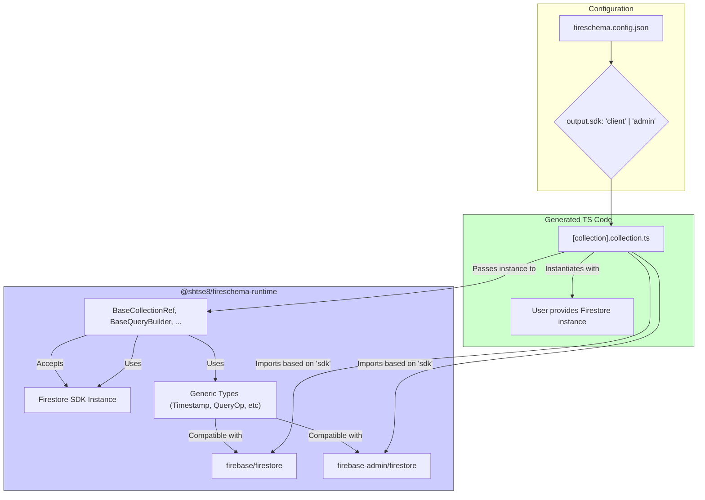

# Plan: Add Firebase Admin Support for TypeScript

**Goal:** Allow users to generate TypeScript code that works with either the
`firebase` (client) SDK or the `firebase-admin` (server) SDK for Firestore
operations, selectable via a configuration option.

**Core Strategy:** Modify the `@shtse8/fireschema-runtime` package to be
compatible with both SDKs by abstracting the core Firestore interactions. The
generated code will then import types and pass the correct Firestore instance
based on the user's configuration.

**Detailed Plan:**

1. **Update Configuration:**
   - Modify Type: Add an optional `sdk` property (allowed values: `"client"`,
     `"admin"`, default: `"client"`) to the TypeScript output target interface
     in `src/types/config.ts`.
   - Update Loader: Adjust `src/configLoader.ts` to read, validate, and pass
     this `sdk` option along.

2. **Refactor TypeScript Runtime (`@shtse8/fireschema-runtime`):**
   - Identify Core Dependencies: List all types and functions currently imported
     directly from `firebase/firestore`.
   - Create Generic Abstraction: Define internal interfaces or type aliases
     within the runtime compatible with both `firebase/firestore` and
     `firebase-admin/firestore`.
   - Modify Base Classes: Update constructors and methods of
     `BaseCollectionRef`, `BaseQueryBuilder`, `BaseUpdateBuilder` to accept a
     Firestore SDK instance and use generic types.
   - Update Peer Dependencies: Modify
     `packages/fireschema-ts-runtime/package.json` to include `firebase-admin`
     as an optional peer dependency.
   - Handle Type Differences: Manage any subtle differences between the SDKs
     within the runtime.

3. **Update TypeScript Generator (`src/generators/typescript.ts` & Templates):**
   - Pass SDK Info: Ensure the `sdk` value ("client" or "admin") is passed to
     the template rendering context.
   - Modify Templates (`templates/typescript/`):
     - Conditional Imports: Use EJS conditionals
       (`<% if (sdk === 'admin') { %>...`) to import from the correct package
       (`firebase/firestore` or `firebase-admin/firestore`).
     - Constructor Injection: Modify `collectionRef.ejs` to accept the
       appropriate `Firestore` instance and pass it to `super()`.
     - Type Usage: Ensure generated types (`*.types.ts`) use types compatible
       with both SDKs.

4. **Update Tests:**
   - Snapshot Tests: Add new test cases for `"sdk": "admin"` configuration and
     verify generated output/imports.
   - (Optional) Runtime Tests: Consider adding mocked tests in the runtime
     package for both SDK environments.

5. **Update Documentation (Memory Bank):**
   - Update `techContext.md`, `productContext.md`, `systemPatterns.md`,
     `activeContext.md`, `progress.md` to reflect the new feature and plan
     execution.

**Visual Plan (Simplified Runtime Change):**

